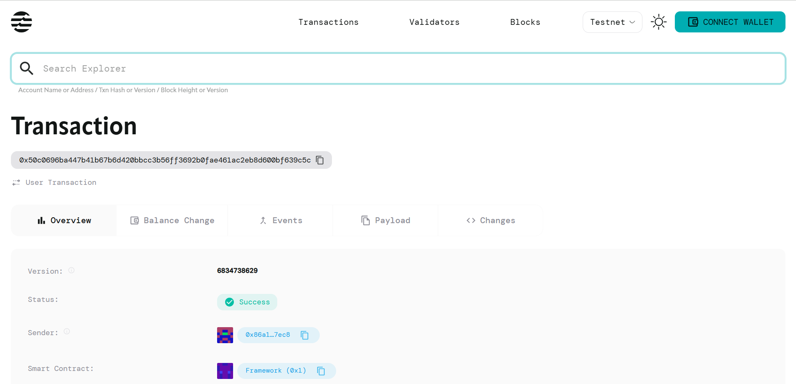

# Token with Transfer Fees

## Project Description

A Move smart contract implementation on the Aptos blockchain that introduces a token system with configurable transfer fees. This contract enables users to create token accounts with customizable fee structures, where a percentage of each transfer is automatically deducted as a fee and sent to a designated fee collector address. The system provides a transparent and automated way to implement transaction fees within token transfers, making it suitable for various decentralized finance (DeFi) applications and token economies.

## Project Vision

Our vision is to create a flexible and efficient fee-based token system that empowers developers and organizations to implement sustainable tokenomics with built-in revenue mechanisms. By providing a simple yet powerful smart contract for fee collection during token transfers, we aim to:

- Enable sustainable token ecosystems with automated fee collection
- Provide a foundation for DeFi protocols requiring transaction fees
- Offer transparency and fairness in fee distribution mechanisms
- Support various business models built on fee-based token transactions
- Foster innovation in blockchain-based financial applications

## Key Features

### 🔧 **Configurable Fee Structure**
- Customizable transfer fee rates (up to 10% maximum)
- Fee rates specified in basis points for precise control
- Per-account fee configuration flexibility

### 💰 **Automated Fee Collection**
- Automatic fee deduction on every token transfer
- Direct fee forwarding to designated collector addresses
- Transparent fee calculation and distribution

### 🛡️ **Security & Validation**
- Built-in balance validation to prevent overdrafts
- Fee rate limits to protect users from excessive charges
- Error handling for invalid operations and insufficient funds

### 📊 **Account Management**
- Individual token account initialization
- Balance tracking and management
- Flexible fee collector assignment

### ⚡ **Efficient Operations**
- Minimal gas consumption for fee calculations
- Streamlined transfer process with integrated fee handling
- Optimized smart contract structure for performance

## Future Scope

### 📈 **Enhanced Features**
- **Dynamic Fee Adjustment**: Implement time-based or volume-based fee modifications
- **Multi-tier Fee Structure**: Different fee rates based on transfer amounts or user tiers
- **Fee Rebate System**: Reward mechanisms for high-volume users or long-term holders

### 🔗 **Integration Capabilities**
- **DeFi Protocol Integration**: Seamless integration with decentralized exchanges and lending platforms
- **Cross-chain Compatibility**: Expand to other blockchain networks beyond Aptos
- **Governance Integration**: Community-driven fee rate adjustments through DAO mechanisms

### 🛠️ **Advanced Functionality**
- **Fee Analytics Dashboard**: Real-time monitoring and reporting of fee collection
- **Batch Transfer Support**: Efficient processing of multiple transfers with optimized fee calculation
- **Smart Fee Distribution**: Automated distribution of collected fees among multiple stakeholders

### 🌐 **Ecosystem Development**
- **Developer Tools**: SDKs and APIs for easy integration into existing applications
- **Template Contracts**: Pre-configured contracts for common use cases
- **Educational Resources**: Comprehensive documentation and tutorials for developers

## Contract Details

0x50c0696ba447b41b67b6d420bbcc3b56ff3692b0fae461ac2eb8d600bf639c5c

